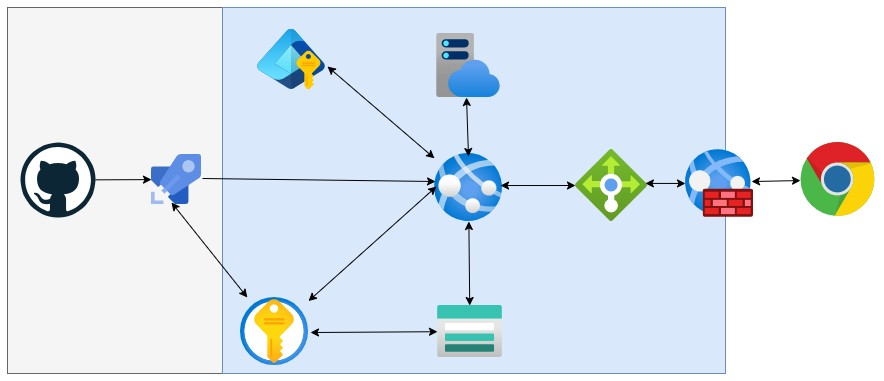

# Aplicação de Gerenciamento de IDSC 1911

## Head
Autor: Leonardo Santos Silva 
Data Release: 14/06/2025 
Status: Produção, V1.0.0 

## Descrição
Esta aplicação web foi desenvolvida em ASP.NET Core para gerenciar competições com até 30 participantes, registrando tempos e penalidades em duas rodadas e gerando uma classificação final baseada no melhor tempo.
Link da Aplicação: https://1911idsc-esbqg7huarehd2ds.centralus-01.azurewebsites.net

## Funcionalidades

- Cadastro de até 30 participantes
- Configuração personalizada de penalidades
- Registro de tempos e penalidades em duas rodadas
- Classificação automática baseada no melhor tempo entre as rodadas
- Exportação dos resultados

## Configuração de Penalidades

A aplicação permite configurar os valores (em segundos) para cada tipo de penalidade:

- **Bravo**: Penalidade leve (padrão: 2s)
- **Charlie**: Penalidade média (padrão: 5s)
- **Miss**: Penalidade por erro de alvo (padrão: 10s)
- **Vítima**: Penalidade por atingir vítima (padrão: 10s)
- **Plate**: Penalidade por erro em plate (padrão: 10s)
- **Fault**: Penalidade por falta (padrão: 10s)
- **Desclassificado**: Valor para indicar desclassificação (padrão: 999s)

## Como Usar

### 1. Configurar Penalidades

Antes de iniciar a competição, acesse a página de configuração de penalidades para definir os valores desejados para cada tipo de penalidade.

### 2. Cadastrar Participantes

Cadastre os participantes da competição (até 30) informando seus nomes.

### 3. Registrar Resultados da Primeira Rodada

Para cada participante, registre:
- Tempo base em segundos
- Quantidade de cada tipo de penalidade (Bravo, Charlie, Miss, etc.)

### 4. Registrar Resultados da Segunda Rodada

Repita o processo para a segunda rodada.

### 5. Visualizar Classificação Final

A classificação final é calculada automaticamente com base no melhor tempo entre as duas rodadas.

### 6. Exportar Resultados

Exporte os resultados para impressão ou arquivamento.

## Requisitos Técnicos

- .NET 8.0 ou superior
- Navegador web moderno (Chrome, Firefox, Edge, Safari)

## Implantação no Azure

Para implantar esta aplicação no Azure Web App (Caso precise implementar no seu ambiente, entre em contato):

